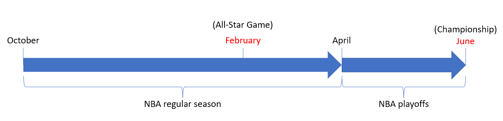
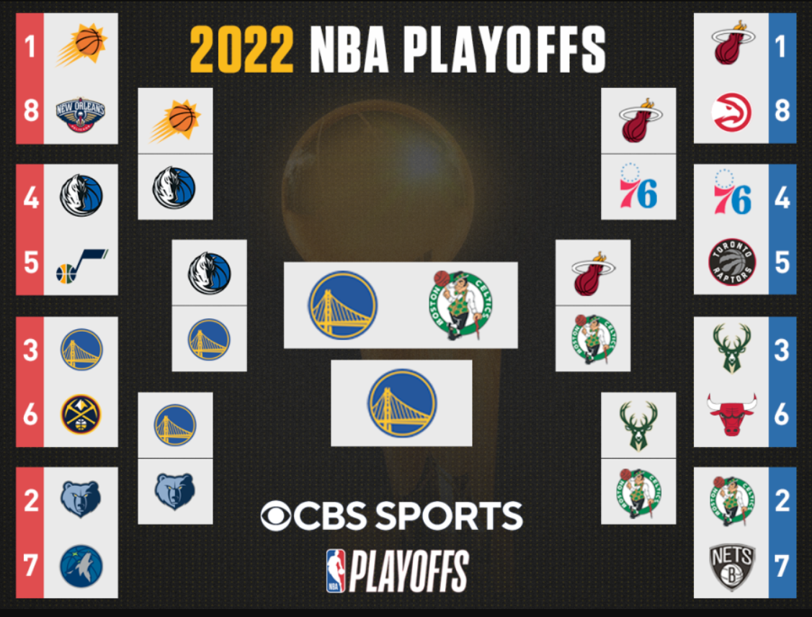
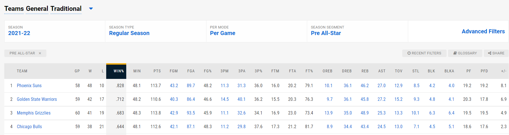
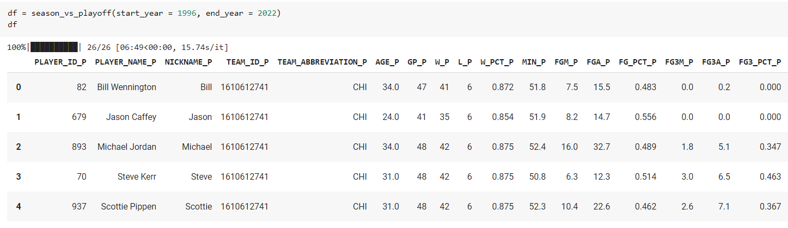
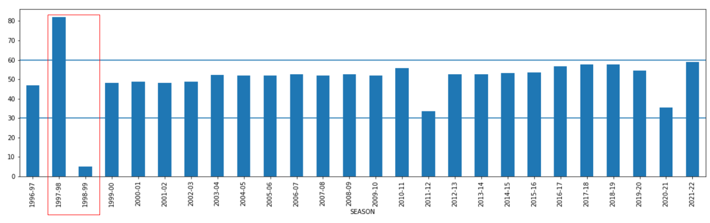
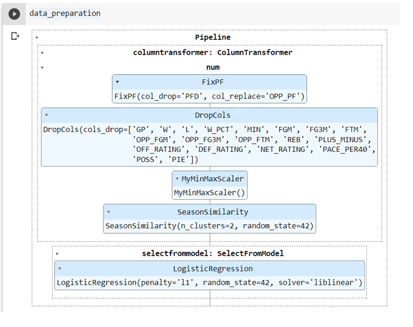
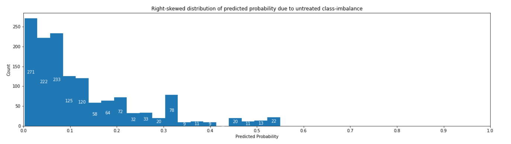
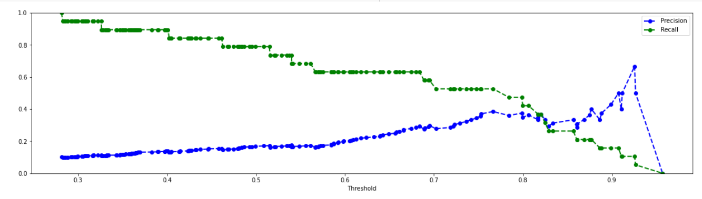

# NBA championship - can you tell which team will win it all before All-Star Game starts?
- resume points xxx

# Framing the business and analytical problem
- Business question
  - How confidently can we tell which team will win the championship 4 months in advance (around when All-Star Game is held)?
  - Timeline of an NBA season
    - 

- Analytical problem
  - To predict the probability of a team winning the championship given its performance in the regular season before All-Star Game
  - This is a supervised classification problem which can be trained offline

# How will my solution be used
- It is a common debate among fans, critics and teams that whether a team can win this year
  - This debate is often the most heated around the All-Star Game in February
    - As a mid-season cutoff, teams have played against each other for a few months already so there is a large enough sample size to analyze
  - Fans argue that despite having a losing record by then, their favorite team just needs more time to make things work
  - Critics would argue that the teams which have been playing well so far don't necessarily play as well in the playoffs (often described as "a different paradigm" vs the regular season)
  - Team managers and coaches would like to know if they can improve the team by adjusting their lineup with some player trades before the trade deadline at around All-Star Game
- My solution as a propensity model with interpretable features will be able to offer insights into which areas a team can focus on / ignore when it comes to improving one's chance to win a championship

# Background
  
- 30 teams (15 in each conference) will compete against each other for 82 games within the regular season
- 16 teams (8 in each conference) will then enter the playoffs with 4 elimination rounds
  - The definition of "top 8" has become more complicated with the recently established play-in tournament ([more details](https://www.nba.com/news/nba-play-in-tournament))
- Final team to survive through all 4 elimination rounds will win the championship (Larry O'Brien Championship Trophy)
  - NBA 2022 champion: Golden State Warriors
  - 

- limitation of existing solutions

- existing knowledge that I can reuse
- is human expertise available
- how would you solve the problem manually
- list assumptions I made so far
- verify assumptions

# How should performance be measured
- Model performance = AUPRC (Area under Precision-Recall curve)
  - sklearn implementation: [AP (Average Precision)](https://scikit-learn.org/stable/modules/generated/sklearn.metrics.average_precision_score.html#sklearn.metrics.average_precision_score)
  - avoid AUROC as TN inflates the number in a problem with class imbalance (3% positive)
- To align with business objective: 
  - Emphasis on precision instead of recall
  - As a team manager / fan, it would be more useful to err on the side of caution and be confident that my prediction is correct, rather than to capture all the winning teams
  - At least 80% precision should be achieved

# Source of data
- NBA team statistics in regular season and playoffs from [NBA.com/stats](https://www.nba.com/stats/teams/traditional/?sort=W_PCT&dir=-1&Season=2021-22&SeasonType=Regular%20Season&SeasonSegment=Pre%20All-Star) using [nba_api from github](https://github.com/swar/nba_api/blob/master/docs/nba_api/stats/endpoints/leaguedashteamstats.md)
  - 
  - X = each row is a team's performance in regular season
    - problem with small dataset (30 teams * 20 seasons = 600 rows)
    - enlarge dataset with player stats (600 players * 20 seasons) = 12,000 rows but this augments our business problem of answering whether a team (not a player) can win
    - 
  - Y = each row is 0 or 1 with 1 being champion
## Type of statistics available
- Base / Advanced / Misc / Four Factors / Scoring / Opponent / Usage / Defense
- Each measures a different aspect of a team's or its opponent's performance in the regular season

## Assumptions 
- setting the scope of data to pre All-Star Game is a good cutoff as mid-season performance
- 
- Some seasons have abnormally high and low number of games played before All-Star Game, e.g. 1997-98 (82 games) and 1998-99 (4 games) due to NBA lockout
- Removed those abnormal seasons such that all the rows represent a good estimate of mid-season cutoff

# Workflow
(more details in /source folder)
1) Train-Test split
2) Exploratory data analysis
3) Data preparation pipeline
  - feature scaling / engineering / selection
  - 
4) Shortlist potential models
5) Hyperparameter tuning with cross-validation
6) Performance evaluation on test set

# Model performance on test set
- xxx

# Findings

## 1. Ways to deal with extreme class-imbalance
> **Only 3%** of the rows represent a team which has won the NBA championship
### 1a) Correct performance measure
- While it is commonly mentioned that accuracy is a bad measure,
- it is less obvious that even AUROC score can be over-optimistic as it takes into account True Negatives (TN)
- More appropriate measure = **AUPRC** (Area under Precision-Recall curve) or **AP** (Average precision)
  - Precision-Recall curve substitutes False Positive Rate with Precision
  - AUPRC can capture a more accurate pricture if you only care about True Positives (TP)
### 1b) What if you don't do any adjustments?
  - 
    
    - Highest predicted probability around 0.5
    - Difficult to correctly classify positive class / draw cutoff for precision and recall
  
### 1c) Solutions
- **Balance class weights or**
  - Several classification models, e.g. SGD, Random Forest, XGBoost, allow you to increase weighting for minority class (ie positive in our case)
  - Increase the cost to misclassify the minority class
- **Create synthetic samples**
  - SMOTE (Synthetic Minority Over-sampling Technique) or ADASYN (Adaptive Synthetic) from imblearn
  - ADASYN uses knn neighborhood and generates more samples in areas where minority class is more rare
  - Aim for positive:negative = 1:1
  

## 2. Controlled vs uncontrolled features
- Uncontrolled features = features that you observe but cannot change
  - e.g. net rating
- Controlled features = features that you observe and can change
  - e.g. offensive rating and defensive rating
- While it is easy to feed the model all the features and let it pick the useful ones with regularization,
- > you might run into the following dilemma when uncontrolled features are the most important ones
1) After regularization, the model only keeps most uncontrolled features but not controlled ones
   - e.g. instead of telling you to focus more on offense, the model only keeps the net rating
   - not useful for business decision
2) Dropping the uncontrolled features and only feeding the model with controlled features
   - the model might have low explanatory power

## 3. Business objective vs data available
- Most important question
  - Which team can win the championship?
  - Data you need is each team's performance in a season
  - However, there are only 30 teams for 20 seasons = 600 rows
  - Dataset is too small
- How to enlarge our dataset
  - Add player stats and combine wth team stats
  - 600 players for 20 seasons = 12k rows
  - However, this changes our objective from predicting **which team** can win to **which player on his team** can win

## 4. Convergence of gradient descent
- Intuitive that scaling speeds up convergence
- Less intuitive, if not counter-intuitive, that 
  - while both MinMaxScaler and QuantileTransformer scales features to a range from 0 to 1, 
  - MinMaxScaler, which keeps the skewness in the data, outcompeted QuantileTransformer, which transforms features into standard uniform distribution
# Issues discovered waiting for future improvements
- Bumpy precision curve with sparse threshold intervals in higher end of the range of predicted probabilities
  - despite adjustments to tackle class-imbalance
  - sometimes precision collapsed to 0 even when threshold is increasing
  - 
- Computational complexity of different models can become an issue if dataset gets larger over time

# Interesting directions
- Instead of framing as binary classification problem,
- Can we view it as a multi-label classification problem?
  - predicted outcome = rank of a team in playoffs
  - teams may be interested in improving their rank and increasing their chance of winning a championship over time when they don't see it possible to win it right now
- Possible solution
  - e.g. ordinal regression using neural network with multi-label binary classifier output layer + rank conformity check using modified cost function mentioned by [Sebastian Raschka](https://open.spotify.com/episode/772tgKNhb2WCdcccN8IHhm?si=Kn3TcF_zRCS0gBUjJBskNA&utm_source=copy-link&t=970)