Stream A = using team stats only

Stream B = using player and team stats together

# Step 1: Load data 

Notebooks:
- 1A_load_data.ipynb
- 1B_load_data_player+team.ipynb

1. Grab player and team stats using [Github NBA API](https://github.com/swar/nba_api) from NBA.com/stats 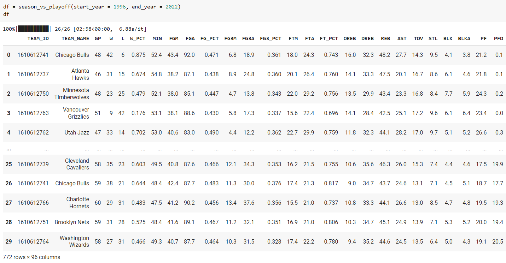

2. Remove outlier seasons with games played (GP) <= 30 games or >= 60 games as we want the cutoff at around mid-season 

3. Fix the datatypes to numeric / category / string such that we can drop them in sklearn pipeline

4. Split dataset into train and test set before any more EDA to prevent data leakage

# Step 2: ML workflow on train set
2 options to tackle class-imbalance:
- balance class weights
  - 2A_ML_workflow_class_balanced_average precision.ipynb
  - 2B_ML_workflow_class_balanced_average precision_player plus team.ipynb
- ADASYN for synthetic samples
  - 2A_ML_workflow_ADASYN_average precision.ipynb
  - 2B_ML_workflow_ADASYN_average precision_player plus team.ipynb

1. Exploratory data analysis 
   - class imbalance: 3% positive only 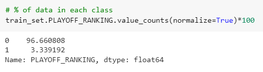
   - correlation matrix 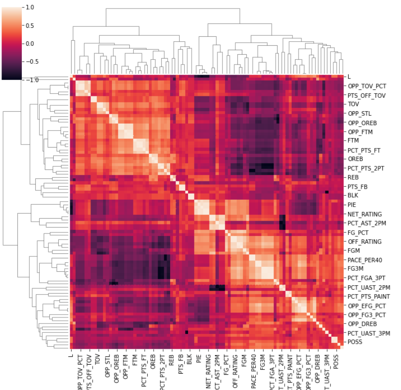
2. Data preparation pipeline
- 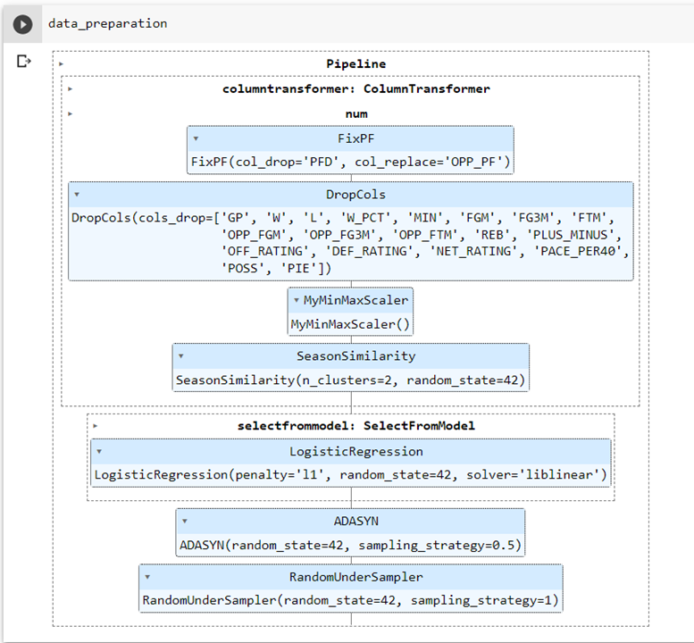
  
  - omit ADASYN and RandomUnderSampler if balancing class weight instead
- feature scaling = MinMaxScaler
- feature engineering = SeasonSimilarity
  - kmeans clustering to represent different NBA eras
  - silhouette score for optimal # of clusters 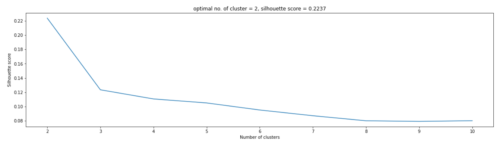
- feature selection = L1 penalty with logisitc regression
  - to reduce training time
  - C = hyperparameter to tune
  - 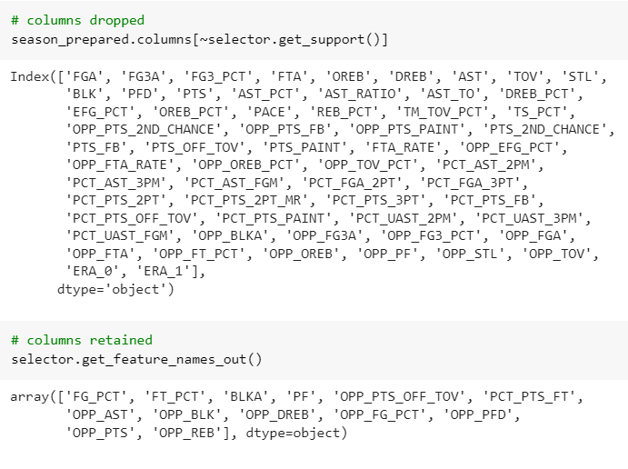
3. Shortlist promising models
   - Quickly check performance of various models using 10-fold cross validation
   - 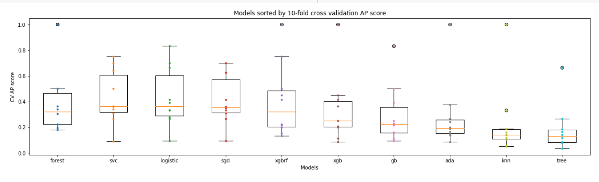
4. Hyperparameter tuning with RandomizedSearchCV
   - Tune top 5 models
   - Specify distribution of each hyperparameter (discrete uniform / continuous uniform / loguniform) 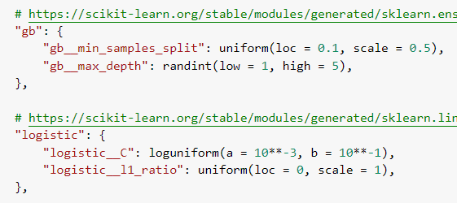
   - Use 10-fold cross validation and 100 iterations to search for best hyperparameters optimizing for Average Precision 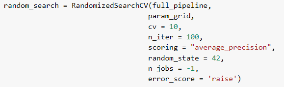
5. Comparing performance on train set
   - Average precision 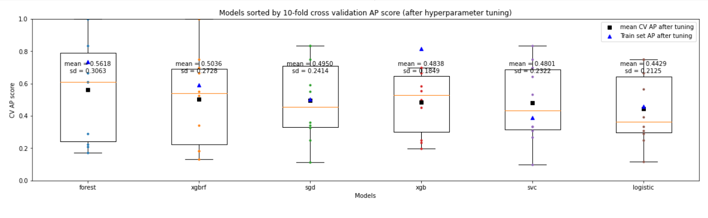
   - AUROC (too optimistic) 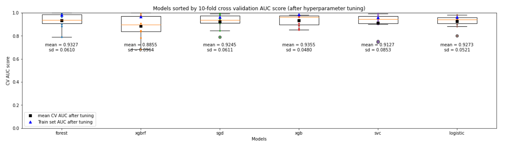
   - Precision-Recall curve 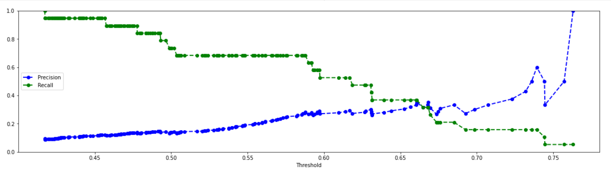
   - Coefficients for interpretability 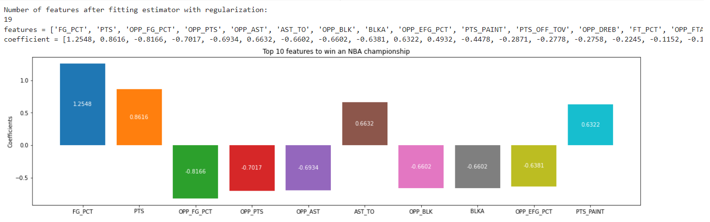

# Step 3: Evaluation on test set (team stats only)
Best model = SGD(log loss) with balanced class weight
## Predicted Probabilities
The model was able to generalize better with a less obvious right skew in predicted probabilities due to class-imbalance
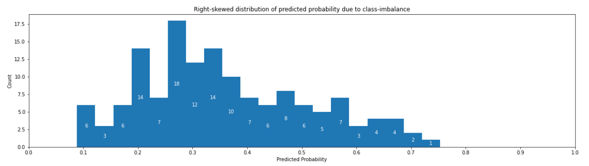

## Precision-Recall Curve
PR curve is still bumpy because of the small test set with 100+ rows only

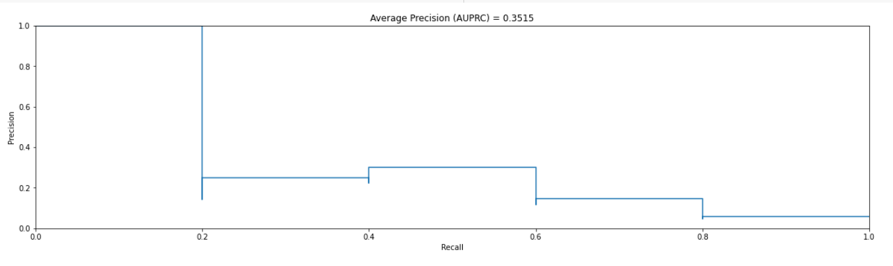
## Average Precision (Area under PR Curve)
AP is worse on test set vs 10-fold CV on train set but still within 1 SD of the CV results
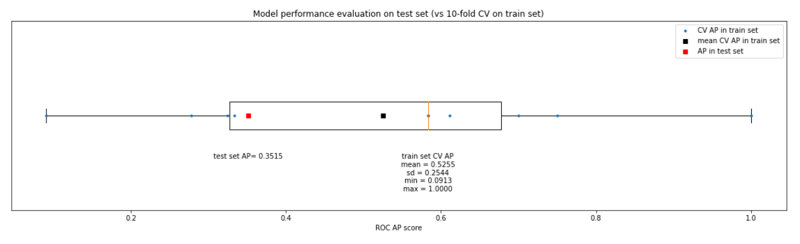
## Lift and gain chart
Lift is good in 1st decile and by focusing on 1st decile, we can capture 60% of the champions
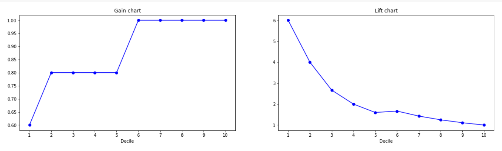
## Coefficients or Feature importance
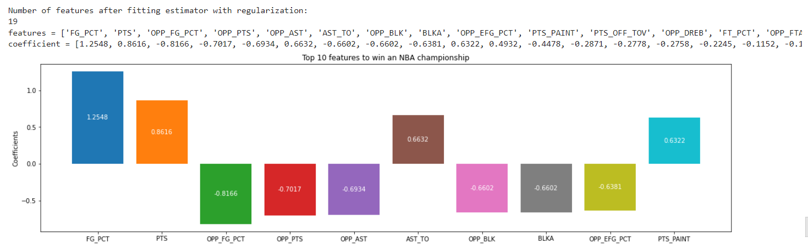

- Before any manipulation, the data set contains 96 features
- After feature selection and other data cleaning procedures, there are 20 features remaining
- Finally, after fitting logistic regression with regularization, we can see that
  - significant variables: 
    - FG_PCT before PTS
      - teams should focus on getting high % shots before chasing for high scoring 
    - AST_TO
      - be careful with the ball and don't turn it over, which can lead to points loss in fast breaks
    - most of the coefficients are related to OPP
      - defense matters to win a championship
      - controlling opponent's FG%, points, assists and blocks

## Teams with greatest regret of not winning a championship
- By sorting teams by predicted probability of winning a championship, we can see which team might had a high chance but didn't win it at last 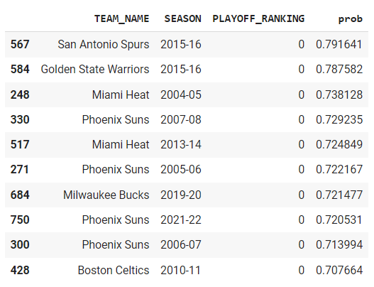
- Honorable mentions include 
  - San Antonio Spurs (2015-16)
    - 2nd in western conference but lost to warriors
    - Tim Duncan retired after the season
  - Golden State Warriors (2015-16)
    - historical 73-9 record in regular season
    - losing to Cavs after leading 3-1 in finals
  - Miami Heat (2004-05)
    - Traded for Shaq from Lakers and achieved franchise's best record since 1996-97 with 53 wins
    - Lost to defending champion Detroit Pistons

# Limitation with a small test set (100+ rows only)  
  - Extremely bumpy precision curve
  - Right-skewed distribution in predicted probabilities
  - Difficult to set decision thresold
    - Given a small test set, you can set a threshold just below the highest predicted probability to reach 100% precision
    - But going forward, can this threshold result in a consistently high precision?
  - Would this change if I have a larger test set to try on? or is the inherent class imbalance in the data that makes it hard to have a high precision?

# Extra: evaluate on test set with team + player stats 
Best model = Gradient Boosting Classifier + ADASYN for over-sampling + Random under-sampling 

> **Adding player stats to predict whether a team could win didn't help**

- While it looked better on train set, evaluation on test set told the opposite
- Precision and recall actually looked worse 
- Average precision is much worse than CV results on train set 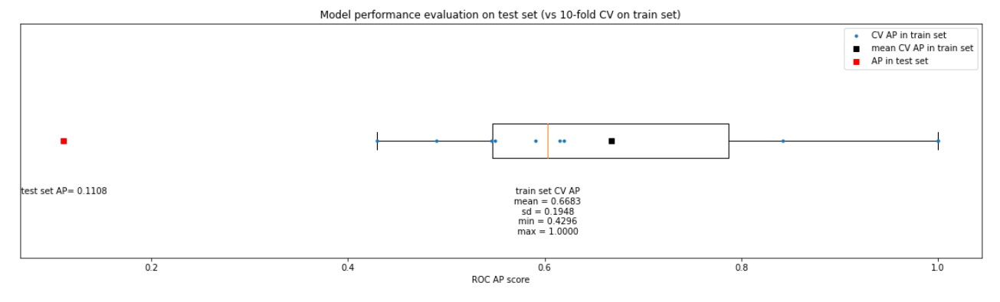
